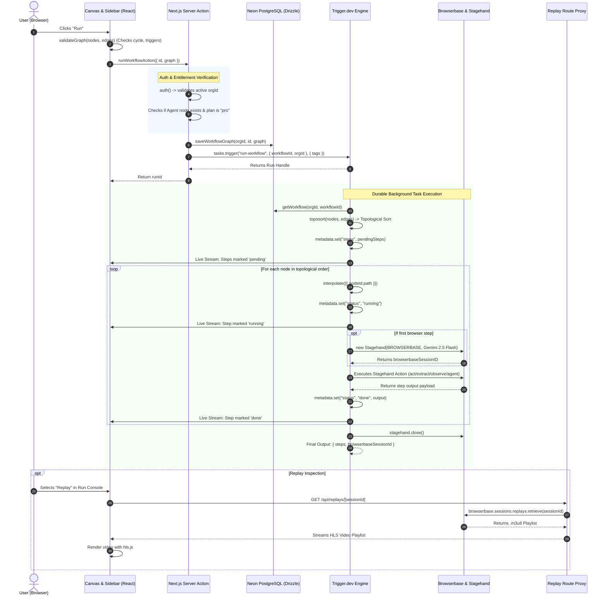

# 🏛️ Navix System Architecture

This document provides an in-depth technical analysis of Navix's architecture, design patterns, data flow mechanisms, and state synchronization boundaries.

---

## 1. Architectural Philosophy & Dual-State Model

A core architectural challenge in visual workflow automation platforms is balancing **low-latency multiplayer collaboration** with **deterministic, durable background execution**.

Navix solves this through an explicit **Dual-State Architecture**:

```
                                      ┌───────────────────────────────────────┐
                                      │           Multiplayer Client          │
                                      └───────┬───────────────────────▲───────┘
                                              │                       │
                       WebSocket Synchronization                      │ Read-Only Scoped Stream
                                              ▼                       │ (Trigger.dev Public Token)
┌────────────────────────────────────────────────────────┐            │
│                 LIVE COLLABORATIVE STATE               │            │
│  - Engine: Liveblocks CRDT Room                        │            │
│  - Source: @liveblocks/react-flow + useLiveblocksFlow  │            │
│  - Data: Live nodes array, edges array, user cursors   │            │
│  - Volatility: In-memory distributed state             │            │
└────────────────────────────┬───────────────────────────┘            │
                             │                                        │
                   "Run" Action Trigger                               │
                   Saves Canonical Snapshot                           │
                             ▼                                        │
┌────────────────────────────────────────────────────────┐            │
│                PERSISTENT EXECUTION STATE              │            │
│  - Database: Neon Serverless Postgres (via Drizzle)    │            │
│  - Table: `workflows.graph` (JSONB)                    │            │
│  - Orchestrator: Trigger.dev v4 Task Engine            │            │
│  - Runner: `run-workflow` background task              ├────────────┘
│  - Sandbox: Browserbase Headless Cloud Chrome          │
└────────────────────────────────────────────────────────┘
```

### Key Differences Between States

| Metric | Live Collaborative State | Persistent Execution State |
| :--- | :--- | :--- |
| **Storage Medium** | Liveblocks Room WebSocket Server | Neon PostgreSQL (`workflows` table) |
| **Data Structure** | Mutable CRDT records (Nodes, Edges, Awareness) | Immutable Snapshot (`WorkflowGraph` JSONB) |
| **Read Access** | Client-side React Flow hooks (`useLiveblocksFlow`) | Server Actions, Background Task Runners |
| **Write Access** | Real-time optimistic user canvas edits | Server Action (`saveWorkflowGraph` upon execution) |
| **Lifecycle** | Exists while users collaborate in the room | Permanent database record |

---

## 2. End-to-End Execution Flow

When a user triggers a workflow run by clicking the **Run** button, the system executes the following coordinated sequence across Next.js, Neon, Trigger.dev, and Browserbase:



---

## 3. Browserbase & Stagehand Session Lifecycle

A critical optimization in Navix is **Session Continuity**. 

### Single-Session Architecture:
Instead of creating a new cloud browser for every node (which would reset cookies, authentication state, and current page URLs), Navix maintains **one shared Browserbase session** throughout the entire execution of a workflow run:

```typescript
// features/workflows/tasks/run-workflow.ts
let stagehand: Stagehand | undefined
let browserbaseSessionId: string | undefined

const getStagehand = async () => {
  if (stagehand) return stagehand
  stagehand = new Stagehand({
    env: "BROWSERBASE",
    apiKey: process.env.BROWSERBASE_API_KEY!,
    model: "google/gemini-2.5-flash",
    disablePino: true, // Required for Trigger.dev bundled runtime
  })
  await stagehand.init()
  browserbaseSessionId = stagehand.browserbaseSessionID
  return stagehand
}
```

### Lifecycle Rules:
1. **Lazy Initialization**: The browser is only spun up when the first browser-dependent action (`open-url`, `act`, `extract`, `observe`, or `agent`) is reached. Non-browser nodes (like `send-email` or triggers) do not incur browser boot overhead.
2. **State Preservation**: Page state, DOM elements, cookies, and session storage persist from node to node.
3. **Graceful Teardown**: The session is closed in a `try...finally` block to ensure cloud instances are terminated and recordings are finalized even if a step encounters a runtime error.

---

## 4. Multi-Tenant Security & Access Boundaries

Navix enforces strict tenant isolation using Clerk Organizations across three distinct tiers:

```
┌─────────────────────────────────────────────────────────────────────────┐
│                           SECURITY BOUNDARIES                           │
├─────────────────────────────────────────────────────────────────────────┤
│ 1. EDGE MIDDLEWARE (proxy.ts)                                           │
│    - Protects all non-auth routes using `clerkMiddleware`.             │
│    - Requires active session before reaching App Router.               │
├─────────────────────────────────────────────────────────────────────────┤
│ 2. LIVEBLOCKS ROOM ACCESS (/api/liveblocks/auth)                        │
│    - Verifies user authentication with `currentUser()`.                │
│    - Restricts user's token permissions to `groupIds: [orgId]`.        │
│    - Liveblocks room created with: `groupsAccesses: { [orgId]: ["room:write"] }`. │
├─────────────────────────────────────────────────────────────────────────┤
│ 3. DATABASE QUERIES (features/workflows/data.ts)                        │
│    - Every select, update, and delete requires both `id` AND `orgId`:   │
│      where(and(eq(workflows.id, id), eq(workflows.orgId, orgId)))      │
├─────────────────────────────────────────────────────────────────────────┤
│ 4. TRIGGER.DEV SCOPED RUN TOKENS (workflows/[id]/page.tsx)              │
│    - Public access tokens for client-side streaming are minted with     │
│      explicit read scope tags: `tags: ["workflow:${id}"]`.              │
└─────────────────────────────────────────────────────────────────────────┘
```

---

## 5. React Component Hierarchy & Context Providers

The workflow builder page (`app/(dashboard)/workflows/[id]/page.tsx`) organizes React contexts into a clean hierarchy to avoid unnecessary re-renders:

```
<Room roomId={id}>                          <-- Liveblocks Room & WebSocket Provider
  <ReactFlowProvider>                       <-- React Flow Canvas Store (Nodes, Edges, Viewport)
    <WorkflowRunsProvider>                  <-- Trigger.dev Real-Time Runs Hook & Stream
      <WorkflowShell>                       <-- Split Resizable Layout
        ├── <Canvas />                      <-- XYFlow Interactive Canvas + Live Cursors
        ├── <ConsolePanel />                <-- Trigger.dev Logs, Duration, & Output Inspector
        └── <RightSidebar />                <-- Node Palette, Property Editors & Run Controls
    </WorkflowRunsProvider>
  </ReactFlowProvider>
</Room>
```

---

## 6. Observability & Error Containment

Error containment is integrated at every architectural boundary:

1. **Pre-flight Validation (`validateGraph`)**: Caught client-side before any network request or database write is initiated.
2. **Server Action Entitlement Check**: Prevents non-Pro organizations from triggering runs with `Agent` nodes.
3. **Execution Catch Blocks (`run-workflow.ts`)**:
   - Catches step failures.
   - Marks the failing step with `status: "failed"` and writes `error: error.message` to Trigger metadata.
   - Flushes metadata so the UI immediately highlights the failed node in red.
   - Closes the active Stagehand browser session cleanly.
4. **Sentry Global Failure Hook (`features/init.ts`)**: Trigger.dev registers `tasks.onFailure` to capture unhandled task crashes, transmitting complete task payloads and runtime metadata to Sentry.
